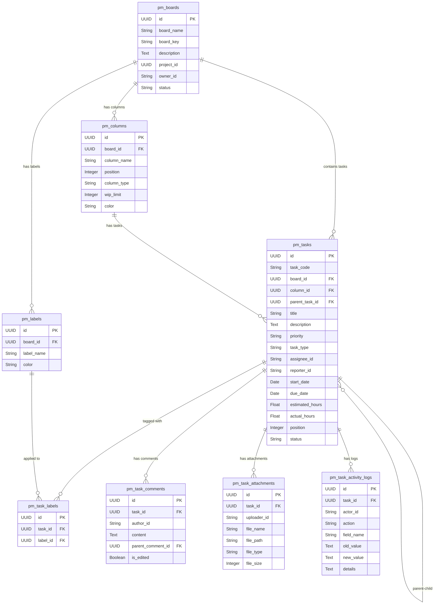
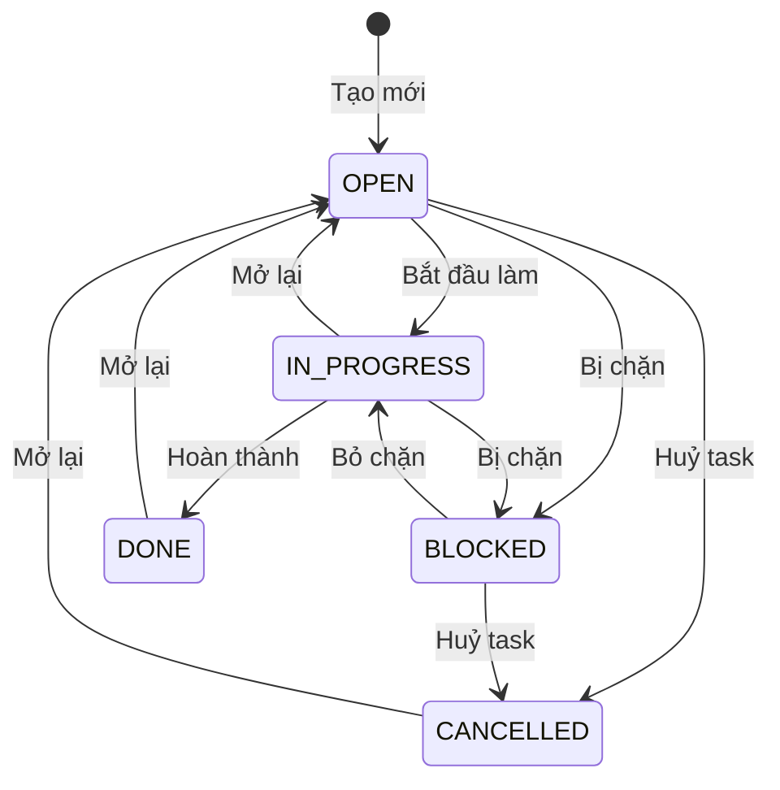

# Project Management Tool — Thiết Kế Database & API

> Ngày cập nhật: 2026-08-02  
> Tech Stack: FastAPI + SQLAlchemy + PostgreSQL + Alembic  
> Base URL: `/api/v1/project-management`  
> Bảng `tasks` hiện có **không bị ảnh hưởng** — hệ thống mới dùng prefix `pm_`.

---

## Mục Lục

1. [Sơ Đồ Quan Hệ (ER Diagram)](#1-sơ-đồ-quan-hệ-er-diagram)
2. [Chi Tiết Bảng Database](#2-chi-tiết-bảng-database)
3. [Workflow Trạng Thái Task](#3-workflow-trạng-thái-task)
4. [Tổng Quan API Endpoints](#4-tổng-quan-api-endpoints)
5. [Hướng Dẫn Sử Dụng Chi Tiết Từng API](#5-hướng-dẫn-sử-dụng-chi-tiết-từng-api)
   - [5.1. Nhóm Board APIs (APIs 1-6)](#51-nhóm-board-apis)
   - [5.2. Nhóm Column APIs (APIs 7-10)](#52-nhóm-column-apis)
   - [5.3. Nhóm Label APIs (APIs 11-14)](#53-nhóm-label-apis)
   - [5.4. Nhóm Task APIs (APIs 15-22)](#54-nhóm-task-apis)
   - [5.5. Nhóm Task Label APIs (APIs 23-24)](#55-nhóm-task-label-apis)
   - [5.6. Nhóm Comment APIs (APIs 25-28)](#56-nhóm-comment-apis)
   - [5.7. Nhóm Attachment APIs (APIs 29-31)](#57-nhóm-attachment-apis)
   - [5.8. Nhóm Activity Log API (API 32)](#58-nhóm-activity-log-api)
   - [5.9. Nhóm Dashboard Stats API (API 33)](#59-nhóm-dashboard-stats-api)
6. [Pydantic Schemas](#6-pydantic-schemas)
7. [Trạng Thái Triển Khai](#7-trạng-thái-triển-khai)

---

## 1. Sơ Đồ Quan Hệ (ER Diagram)



---

## 2. Chi Tiết Bảng Database

### 2.1. `pm_boards` — Bảng Dự Án
| Cột | Kiểu | Ràng buộc | Mô tả |
|-----|------|-----------|-------|
| `id` | `UUID` | PK, default `uuid4` | ID bảng dự án |
| `board_name` | `String` | NOT NULL | Tên board (VD: "Sprint Tháng 8") |
| `board_key` | `String` | UNIQUE, INDEX | Mã viết tắt (VD: "TN", "HDG") — dùng sinh task code |
| `description` | `Text` | nullable | Mô tả board |
| `project_id` | `UUID` | nullable, INDEX | FK → `projects.id` |
| `owner_id` | `String` | NOT NULL | Employee ID người tạo board |
| `default_assignee_id` | `String` | nullable | Employee ID mặc định được giao task |
| `status` | `String` | default `"ACTIVE"` | `ACTIVE` / `ARCHIVED` |
| `created_at` | `DateTime` | auto | Ngày tạo |
| `updated_at` | `DateTime` | auto | Ngày cập nhật |

---

### 2.2. `pm_columns` — Cột Trạng Thái (Kanban)
| Cột | Kiểu | Ràng buộc | Mô tả |
|-----|------|-----------|-------|
| `id` | `UUID` | PK, default `uuid4` | ID cột |
| `board_id` | `UUID` | NOT NULL, INDEX | FK → `pm_boards.id` |
| `column_name` | `String` | NOT NULL | Tên cột (VD: "Cần Làm", "Đang Làm") |
| `position` | `Integer` | NOT NULL, default `0` | Thứ tự hiển thị |
| `column_type` | `String` | default `"TODO"` | `TODO` / `IN_PROGRESS` / `DONE` / `CANCELLED` |
| `wip_limit` | `Integer` | nullable | Giới hạn WIP (null = không giới hạn) |
| `color` | `String` | nullable | Mã màu (VD: "#3B82F6") |
| `created_at` | `DateTime` | auto | Ngày tạo |

---

### 2.3. `pm_labels` — Nhãn (Tag)
| Cột | Kiểu | Ràng buộc | Mô tả |
|-----|------|-----------|-------|
| `id` | `UUID` | PK, default `uuid4` | ID nhãn |
| `board_id` | `UUID` | NOT NULL, INDEX | FK → `pm_boards.id` |
| `label_name` | `String` | NOT NULL | Tên nhãn (VD: "Bug", "Feature", "Urgent") |
| `color` | `String` | NOT NULL | Mã màu (VD: "#EF4444") |

---

### 2.4. `pm_tasks` — Công Việc (Core Table)
| Cột | Kiểu | Ràng buộc | Mô tả |
|-----|------|-----------|-------|
| `id` | `UUID` | PK, default `uuid4` | ID task |
| `task_code` | `String` | UNIQUE, INDEX | Mã task tự sinh (VD: "TN-001") |
| `board_id` | `UUID` | NOT NULL, INDEX | FK → `pm_boards.id` |
| `column_id` | `UUID` | NOT NULL, INDEX | FK → `pm_columns.id` |
| `parent_task_id` | `UUID` | nullable, INDEX | FK → `pm_tasks.id` (sub-task) |
| `title` | `String` | NOT NULL | Tiêu đề task |
| `description` | `Text` | nullable | Mô tả chi tiết (Markdown) |
| `priority` | `String` | default `"MEDIUM"` | `CRITICAL` / `HIGH` / `MEDIUM` / `LOW` |
| `task_type` | `String` | default `"TASK"` | `TASK` / `BUG` / `STORY` / `EPIC` / `SUB_TASK` |
| `assignee_id` | `String` | nullable, INDEX | Employee ID người được giao |
| `reporter_id` | `String` | nullable | Employee ID người tạo |
| `start_date` | `Date` | nullable | Ngày bắt đầu |
| `due_date` | `Date` | nullable | Ngày deadline |
| `completed_at` | `DateTime` | nullable | Thời gian hoàn thành thực tế |
| `estimated_hours` | `Float` | nullable | Thời gian ước tính (giờ) |
| `actual_hours` | `Float` | nullable | Thời gian thực tế (giờ) |
| `position` | `Integer` | default `0` | Thứ tự trong column (drag & drop) |
| `status` | `String` | default `"OPEN"` | `OPEN` / `IN_PROGRESS` / `DONE` / `CANCELLED` / `BLOCKED` |
| `created_at` | `DateTime` | auto | Ngày tạo |
| `updated_at` | `DateTime` | auto | Ngày cập nhật |

---

### 2.5. `pm_task_labels` — Liên Kết Task ↔ Label (M2M)
| Cột | Kiểu | Ràng buộc | Mô tả |
|-----|------|-----------|-------|
| `id` | `UUID` | PK, default `uuid4` | ID |
| `task_id` | `UUID` | NOT NULL, INDEX | FK → `pm_tasks.id` |
| `label_id` | `UUID` | NOT NULL, INDEX | FK → `pm_labels.id` |

---

### 2.6. `pm_task_comments` — Bình Luận
| Cột | Kiểu | Ràng buộc | Mô tả |
|-----|------|-----------|-------|
| `id` | `UUID` | PK, default `uuid4` | ID comment |
| `task_id` | `UUID` | NOT NULL, INDEX | FK → `pm_tasks.id` |
| `author_id` | `String` | NOT NULL | Employee ID |
| `content` | `Text` | NOT NULL | Nội dung (Markdown) |
| `parent_comment_id` | `UUID` | nullable | FK → `pm_task_comments.id` (reply) |
| `is_edited` | `Boolean` | default `False` | Đánh dấu đã sửa |
| `created_at` | `DateTime` | auto | Ngày tạo |
| `updated_at` | `DateTime` | auto | Ngày cập nhật |

---

### 2.7. `pm_task_attachments` — File Đính Kèm
| Cột | Kiểu | Ràng buộc | Mô tả |
|-----|------|-----------|-------|
| `id` | `UUID` | PK, default `uuid4` | ID attachment |
| `task_id` | `UUID` | NOT NULL, INDEX | FK → `pm_tasks.id` |
| `uploader_id` | `String` | NOT NULL | Employee ID |
| `file_name` | `String` | NOT NULL | Tên file gốc |
| `file_path` | `String` | NOT NULL | Đường dẫn server |
| `file_type` | `String` | nullable | MIME type |
| `file_size` | `Integer` | nullable | Kích thước (bytes) |
| `uploaded_at` | `DateTime` | auto | Thời gian upload |

---

### 2.8. `pm_task_activity_logs` — Lịch Sử Hoạt Động
| Cột | Kiểu | Ràng buộc | Mô tả |
|-----|------|-----------|-------|
| `id` | `UUID` | PK, default `uuid4` | ID log |
| `task_id` | `UUID` | NOT NULL, INDEX | FK → `pm_tasks.id` |
| `actor_id` | `String` | NOT NULL | Employee ID |
| `action` | `String` | NOT NULL | Loại hành động |
| `field_name` | `String` | nullable | Trường bị thay đổi |
| `old_value` | `Text` | nullable | Giá trị cũ |
| `new_value` | `Text` | nullable | Giá trị mới |
| `details` | `Text` | nullable | Mô tả bổ sung |
| `created_at` | `DateTime` | auto | Thời gian |

---

## 3. Workflow Trạng Thái Task



---

## 4. Tổng Quan API Endpoints

| # | Method | Endpoint | Mô tả |
|---|--------|----------|-------|
| 1 | `GET` | `/api/v1/project-management/get-boards` | Lấy danh sách boards |
| 2 | `GET` | `/api/v1/project-management/get-board/{board_id}` | Lấy chi tiết 1 board (kèm columns, tasks, labels) |
| 3 | `POST` | `/api/v1/project-management/add-boards` | Tạo mới boards (tự động tạo 4 cột mặc định) |
| 4 | `POST` | `/api/v1/project-management/update-boards` | Cập nhật thông tin boards |
| 5 | `DELETE` | `/api/v1/project-management/delete-boards` | Xoá hàng loạt boards |
| 6 | `POST` | `/api/v1/project-management/archive-board/{board_id}` | Lưu trữ (archive) board |
| 7 | `GET` | `/api/v1/project-management/get-columns` | Lấy danh sách cột Kanban |
| 8 | `POST` | `/api/v1/project-management/add-columns` | Thêm cột Kanban mới |
| 9 | `POST` | `/api/v1/project-management/update-columns` | Cập nhật / đổi vị trí cột Kanban |
| 10 | `DELETE` | `/api/v1/project-management/delete-columns` | Xoá cột Kanban (có hỗ trợ chuyển task) |
| 11 | `GET` | `/api/v1/project-management/get-labels` | Lấy danh sách nhãn |
| 12 | `POST` | `/api/v1/project-management/add-labels` | Tạo mới nhãn |
| 13 | `POST` | `/api/v1/project-management/update-labels` | Cập nhật nhãn |
| 14 | `DELETE` | `/api/v1/project-management/delete-labels` | Xoá nhãn |
| 15 | `GET` | `/api/v1/project-management/get-tasks` | Lấy danh sách tasks (lọc đa chiều) |
| 16 | `GET` | `/api/v1/project-management/get-task/{task_id}` | Lấy chi tiết đầy đủ 1 task |
| 17 | `POST` | `/api/v1/project-management/add-tasks` | Tạo mới tasks (tự sinh mã task_code) |
| 18 | `POST` | `/api/v1/project-management/update-tasks` | Cập nhật thông tin tasks |
| 19 | `DELETE` | `/api/v1/project-management/delete-tasks` | Xoá tasks |
| 20 | `POST` | `/api/v1/project-management/move-task` | Kéo thả task sang cột khác |
| 21 | `POST` | `/api/v1/project-management/reorder-tasks` | Sắp xếp lại thứ tự tasks trong cột |
| 22 | `POST` | `/api/v1/project-management/assign-task` | Phân công người thực hiện task |
| 23 | `POST` | `/api/v1/project-management/add-task-labels` | Gắn nhãn vào task |
| 24 | `DELETE` | `/api/v1/project-management/delete-task-labels` | Gỡ nhãn khỏi task |
| 25 | `GET` | `/api/v1/project-management/get-task-comments` | Lấy danh sách bình luận trong task |
| 26 | `POST` | `/api/v1/project-management/add-task-comments` | Thêm bình luận |
| 27 | `POST` | `/api/v1/project-management/update-task-comments` | Sửa bình luận |
| 28 | `DELETE` | `/api/v1/project-management/delete-task-comments` | Xoá bình luận |
| 29 | `GET` | `/api/v1/project-management/get-task-attachments` | Lấy danh sách file đính kèm |
| 30 | `POST` | `/api/v1/project-management/upload-task-attachment` | Tải file đính kèm lên task |
| 31 | `DELETE` | `/api/v1/project-management/delete-task-attachments` | Xoá file đính kèm |
| 32 | `GET` | `/api/v1/project-management/get-task-activity-logs` | Lấy nhật ký hoạt động của task |
| 33 | `GET` | `/api/v1/project-management/board-stats/{board_id}` | Lấy thống kê tổng quan của board |

---

## 5. Hướng Dẫn Sử Dụng Chi Tiết Từng API

---

### 5.1. Nhóm Board APIs

#### API 1: `GET /api/v1/project-management/get-boards`
- **Mục đích**: Lấy danh sách tất cả các bảng công việc (Board). Dùng cho trang danh sách dự án.
- **Query Params**:
  - `status` (String, optional, mặc định `"ACTIVE"`): Lọc theo trạng thái (`ACTIVE` hoặc `ARCHIVED`).
- **Response Example**:
```json
[
  {
    "id": "a0eebc99-9c0b-4ef8-bb6d-6bb9bd380a11",
    "board_name": "Dự Án Tiến Nga 2026",
    "board_key": "TN",
    "description": "Quản lý công việc thu mua và kho mủ",
    "project_id": null,
    "owner_id": "TN001",
    "default_assignee_id": "TN002",
    "status": "ACTIVE",
    "created_at": "2026-08-02T14:00:00",
    "updated_at": "2026-08-02T14:00:00"
  }
]
```

---

#### API 2: `GET /api/v1/project-management/get-board/{board_id}`
- **Mục đích**: Lấy toàn bộ dữ liệu chi tiết của 1 Board bao gồm các Cột Kanban, danh sách Task gọn trong từng cột và các Labels. Dùng để render giao diện **Kanban Board**.
- **Path Params**:
  - `board_id` (UUID): ID của Board.
- **Response Example**:
```json
{
  "id": "a0eebc99-9c0b-4ef8-bb6d-6bb9bd380a11",
  "board_name": "Dự Án Tiến Nga 2026",
  "board_key": "TN",
  "description": "Quản lý công việc thu mua",
  "project_id": null,
  "owner_id": "TN001",
  "default_assignee_id": "TN002",
  "status": "ACTIVE",
  "created_at": "2026-08-02T14:00:00",
  "updated_at": "2026-08-02T14:00:00",
  "columns": [
    {
      "id": "b1eebc99-9c0b-4ef8-bb6d-6bb9bd380a22",
      "board_id": "a0eebc99-9c0b-4ef8-bb6d-6bb9bd380a11",
      "column_name": "Cần Làm",
      "position": 0,
      "column_type": "TODO",
      "wip_limit": null,
      "color": "#3B82F6",
      "created_at": "2026-08-02T14:00:00",
      "tasks": [
        {
          "id": "c2eebc99-9c0b-4ef8-bb6d-6bb9bd380a33",
          "task_code": "TN-001",
          "board_id": "a0eebc99-9c0b-4ef8-bb6d-6bb9bd380a11",
          "column_id": "b1eebc99-9c0b-4ef8-bb6d-6bb9bd380a22",
          "parent_task_id": null,
          "title": "Kiểm tra sổ thu mua",
          "priority": "HIGH",
          "task_type": "TASK",
          "assignee_id": "TN002",
          "due_date": "2026-08-10",
          "position": 0,
          "status": "OPEN",
          "labels": [
            {
              "id": "d3eebc99-9c0b-4ef8-bb6d-6bb9bd380a44",
              "board_id": "a0eebc99-9c0b-4ef8-bb6d-6bb9bd380a11",
              "label_name": "Gấp",
              "color": "#EF4444"
            }
          ],
          "sub_task_count": 0,
          "comment_count": 2
        }
      ]
    }
  ],
  "labels": [
    {
      "id": "d3eebc99-9c0b-4ef8-bb6d-6bb9bd380a44",
      "board_id": "a0eebc99-9c0b-4ef8-bb6d-6bb9bd380a11",
      "label_name": "Gấp",
      "color": "#EF4444"
    }
  ]
}
```

---

#### API 3: `POST /api/v1/project-management/add-boards`
- **Mục đích**: Tạo mới một hoặc nhiều Board. **Hệ thống sẽ tự động khởi tạo 4 cột Kanban mặc định** (`Cần Làm`, `Đang Làm`, `Hoàn Thành`, `Huỷ`).
- **Request Body**: `List[BoardCreate]`
```json
[
  {
    "board_name": "Dự Án Tiến Nga 2026",
    "board_key": "TN",
    "description": "Quản lý công việc kho và vật tư",
    "owner_id": "TN001",
    "default_assignee_id": "TN002"
  }
]
```
- **Response Example**: Tra về `List[BoardResponse]`.

---

#### API 4: `POST /api/v1/project-management/update-boards`
- **Mục đích**: Cập nhật thông tin của một hoặc nhiều Board.
- **Request Body**: `List[BoardBulkUpdate]`
```json
[
  {
    "id": "a0eebc99-9c0b-4ef8-bb6d-6bb9bd380a11",
    "board_name": "Dự Án Tiến Nga (Đã cập nhật)",
    "description": "Mô tả mới"
  }
]
```
- **Response Example**: Tra về `List[BoardResponse]`.

---

#### API 5: `DELETE /api/v1/project-management/delete-boards`
- **Mục đích**: Xoá vĩnh viễn danh sách Board (CASCADE xoá toàn bộ columns và tasks thuộc board).
- **Query Params**: `ids` (Danh sách UUID).
  - VD: `/api/v1/project-management/delete-boards?ids=a0eebc99-9c0b-4ef8-bb6d-6bb9bd380a11`
- **Response Example**:
```json
{
  "deleted_ids": [
    "a0eebc99-9c0b-4ef8-bb6d-6bb9bd380a11"
  ]
}
```

---

#### API 6: `POST /api/v1/project-management/archive-board/{board_id}`
- **Mục đích**: Chuyển trạng thái của Board sang `ARCHIVED` (không xoá dữ liệu).
- **Path Params**: `board_id` (UUID).
- **Response Example**: Trả về `BoardResponse` đã cập nhật status.

---

### 5.2. Nhóm Column APIs

#### API 7: `GET /api/v1/project-management/get-columns`
- **Mục đích**: Lấy danh sách các Cột Kanban theo `board_id`.
- **Query Params**: `board_id` (UUID, optional).
- **Response Example**: Trả về `List[ColumnResponse]`.

---

#### API 8: `POST /api/v1/project-management/add-columns`
- **Mục đích**: Thêm cột Kanban mới vào Board.
- **Request Body**: `List[ColumnCreate]`
```json
[
  {
    "board_id": "a0eebc99-9c0b-4ef8-bb6d-6bb9bd380a11",
    "column_name": "Đang Review",
    "position": 2,
    "column_type": "IN_PROGRESS",
    "color": "#8B5CF6"
  }
]
```
- **Response Example**: Trả về `List[ColumnResponse]`.

---

#### API 9: `POST /api/v1/project-management/update-columns`
- **Mục đích**: Chỉnh sửa thông tin cột hoặc cập nhật lại thứ tự sắp xếp (`position`) của các cột.
- **Request Body**: `List[ColumnBulkUpdate]`
```json
[
  { "id": "col-uuid-1", "position": 0 },
  { "id": "col-uuid-2", "position": 1 }
]
```
- **Response Example**: Trả về `List[ColumnResponse]`.

---

#### API 10: `DELETE /api/v1/project-management/delete-columns`
- **Mục đích**: Xoá cột Kanban. Nếu truyền `move_to`, tất cả tasks trong cột bị xoá sẽ tự chuyển sang cột mới trước khi xoá.
- **Query Params**: `ids` (list UUID), `move_to` (UUID, optional).
  - VD: `/api/v1/project-management/delete-columns?ids=col-uuid-1&move_to=col-uuid-2`
- **Response Example**: `{"deleted_ids": ["col-uuid-1"]}`

---

### 5.3. Nhóm Label APIs

#### API 11: `GET /api/v1/project-management/get-labels`
- **Mục đích**: Lấy danh sách nhãn phân loại theo `board_id`.
- **Query Params**: `board_id` (UUID, optional).
- **Response Example**: Trả về `List[LabelResponse]`.

---

#### API 12: `POST /api/v1/project-management/add-labels`
- **Mục đích**: Tạo mới các nhãn phân loại cho Board.
- **Request Body**: `List[LabelCreate]`
```json
[
  {
    "board_id": "a0eebc99-9c0b-4ef8-bb6d-6bb9bd380a11",
    "label_name": "Bug",
    "color": "#EF4444"
  }
]
```
- **Response Example**: Trả về `List[LabelResponse]`.

---

#### API 13: `POST /api/v1/project-management/update-labels`
- **Mục đích**: Cập nhật tên hoặc màu sắc của nhãn.
- **Request Body**: `List[LabelBulkUpdate]`
```json
[
  {
    "id": "label-uuid-1",
    "label_name": "Sự cố nghiêm trọng",
    "color": "#DC2626"
  }
]
```
- **Response Example**: Trả về `List[LabelResponse]`.

---

#### API 14: `DELETE /api/v1/project-management/delete-labels`
- **Mục đích**: Xoá nhãn khỏi hệ thống (tự động gỡ khỏi tất cả task đang gắn).
- **Query Params**: `ids` (List UUID).
- **Response Example**: `{"deleted_ids": ["label-uuid-1"]}`

---

### 5.4. Nhóm Task APIs

#### API 15: `GET /api/v1/project-management/get-tasks`
- **Mục đích**: Tìm kiếm & lọc danh sách Task gọn (Summary) theo nhiều tiêu chí.
- **Query Params**:
  - `board_id` (UUID, **bắt buộc**): ID của Board.
  - `column_id` (UUID, optional): Lọc theo cột.
  - `assignee_id` (String, optional): Lọc theo người làm.
  - `reporter_id` (String, optional): Lọc theo người tạo.
  - `status` (String, optional): `OPEN`, `IN_PROGRESS`, `DONE`, `CANCELLED`, `BLOCKED`.
  - `priority` (String, optional): `CRITICAL`, `HIGH`, `MEDIUM`, `LOW`.
  - `task_type` (String, optional): `TASK`, `BUG`, `STORY`, `EPIC`, `SUB_TASK`.
  - `parent_task_id` (UUID, optional): Lọc các sub-task của task cha.
  - `search` | String | Tìm kiếm từ khoá trong tiêu đề hoặc mã task code.
  - `due_date_from` | Date | Hạn chót từ ngày.
  - `due_date_to` | Date | Hạn chót đến ngày.
- **Response Example**: Trả về `List[TaskSummaryResponse]`.

---

#### API 16: `GET /api/v1/project-management/get-task/{task_id}`
- **Mục đích**: Lấy toàn bộ thông tin chi tiết của 1 Task (bao gồm cả: danh sách Sub-tasks, Labels, Comments, Attachments và Activity Logs). Dùng khi mở **Modal Modal Chi Tiết Task**.
- **Path Params**: `task_id` (UUID).
- **Response Example**: Trả về `TaskDetailResponse`.

---

#### API 17: `POST /api/v1/project-management/add-tasks`
- **Mục đích**: Tạo một hoặc nhiều Task mới. **Mã `task_code` sẽ được hệ thống sinh tự động** (VD: Board `TN` -> `TN-001`). Nếu không truyền `column_id`, task sẽ tự xếp vào Cột đầu tiên.
- **Request Body**: `List[TaskCreate]`
```json
[
  {
    "board_id": "a0eebc99-9c0b-4ef8-bb6d-6bb9bd380a11",
    "title": "Thu mua mủ đợt 1",
    "description": "Kiểm tra trọng lượng và lập hóa đơn",
    "priority": "HIGH",
    "task_type": "TASK",
    "assignee_id": "TN002",
    "reporter_id": "TN001",
    "due_date": "2026-08-15"
  }
]
```
- **Response Example**: Trả về `List[TaskSummaryResponse]`.

---

#### API 18: `POST /api/v1/project-management/update-tasks`
- **Mục đích**: Cập nhật thông tin chi tiết của Task (Tiêu đề, mô tả, ngày hạn, số giờ...). Hệ thống sẽ **tự động ghi log hoạt động** vào Activity Log.
- **Request Body**: `List[TaskBulkUpdate]`
```json
[
  {
    "id": "c2eebc99-9c0b-4ef8-bb6d-6bb9bd380a33",
    "title": "Thu mua mủ đợt 1 (Đã chỉnh)",
    "priority": "CRITICAL",
    "actual_hours": 4.5
  }
]
```
- **Response Example**: Trả về `List[TaskSummaryResponse]`.

---

#### API 19: `DELETE /api/v1/project-management/delete-tasks`
- **Mục đích**: Xoá vĩnh viễn danh sách Task.
- **Query Params**: `ids` (List UUID).
- **Response Example**: `{"deleted_ids": ["c2eebc99-9c0b-4ef8-bb6d-6bb9bd380a33"]}`

---

#### API 20: `POST /api/v1/project-management/move-task`
- **Mục đích**: Xử lý hành động **Kéo - Thả (Drag & Drop) Task** giữa các Cột Kanban. Hệ thống sẽ tự động đồng bộ `status` tương ứng với `column_type` của cột đích.
- **Request Body**: `MoveTaskRequest`
```json
{
  "task_id": "c2eebc99-9c0b-4ef8-bb6d-6bb9bd380a33",
  "target_column_id": "col-uuid-done",
  "position": 0
}
```
- **Response Example**: Trả về `TaskSummaryResponse` đã được chuyển cột.

---

#### API 21: `POST /api/v1/project-management/reorder-tasks`
- **Mục đích**: Sắp xếp lại vị trí thứ tự trên-dưới (`position`) của các Task trong cùng một Cột Kanban.
- **Request Body**: `List[ReorderTaskItem]`
```json
[
  { "task_id": "task-uuid-1", "position": 0 },
  { "task_id": "task-uuid-2", "position": 1 }
]
```
- **Response Example**: `{"success": true}`

---

#### API 22: `POST /api/v1/project-management/assign-task`
- **Mục đích**: Phân công hoặc đổi người phụ trách Task.
- **Request Body**: `AssignTaskRequest`
```json
{
  "task_id": "c2eebc99-9c0b-4ef8-bb6d-6bb9bd380a33",
  "assignee_id": "TN003"
}
```
- **Response Example**: Trả về `TaskSummaryResponse`.

---

### 5.5. Nhóm Task Label APIs

#### API 23: `POST /api/v1/project-management/add-task-labels`
- **Mục đích**: Gắn nhãn (Label) vào Task.
- **Request Body**: `List[TaskLabelCreate]`
```json
[
  {
    "task_id": "c2eebc99-9c0b-4ef8-bb6d-6bb9bd380a33",
    "label_id": "d3eebc99-9c0b-4ef8-bb6d-6bb9bd380a44"
  }
]
```
- **Response Example**: Trả về `List[TaskLabelResponse]`.

---

#### API 24: `DELETE /api/v1/project-management/delete-task-labels`
- **Mục đích**: Gỡ nhãn khỏi Task.
- **Query Params**: `ids` (List UUID liên kết).
- **Response Example**: `{"deleted_ids": ["task-label-uuid-1"]}`

---

### 5.6. Nhóm Comment APIs

#### API 25: `GET /api/v1/project-management/get-task-comments`
- **Mục đích**: Lấy tất cả bình luận trong một Task (sắp xếp theo thời gian tăng dần).
- **Query Params**: `task_id` (UUID, **bắt buộc**).
- **Response Example**: Trả về `List[CommentResponse]`.

---

#### API 26: `POST /api/v1/project-management/add-task-comments`
- **Mục đích**: Đăng bình luận mới vào Task (hỗ trợ trả lời comment khác bằng `parent_comment_id`).
- **Request Body**: `List[CommentCreate]`
```json
[
  {
    "task_id": "c2eebc99-9c0b-4ef8-bb6d-6bb9bd380a33",
    "author_id": "TN001",
    "content": "Đã hoàn thành kiểm tra sổ sách.",
    "parent_comment_id": null
  }
]
```
- **Response Example**: Trả về `List[CommentResponse]`.

---

#### API 27: `POST /api/v1/project-management/update-task-comments`
- **Mục đích**: Chỉnh sửa nội dung bình luận (tự động đánh dấu `is_edited = true`).
- **Request Body**: `List[CommentBulkUpdate]`
```json
[
  {
    "id": "comment-uuid-1",
    "content": "Nội dung bình luận đã sửa"
  }
]
```
- **Response Example**: Trả về `List[CommentResponse]`.

---

#### API 28: `DELETE /api/v1/project-management/delete-task-comments`
- **Mục đích**: Xoá bình luận.
- **Query Params**: `ids` (List UUID).
- **Response Example**: `{"deleted_ids": ["comment-uuid-1"]}`

---

### 5.7. Nhóm Attachment APIs

#### API 29: `GET /api/v1/project-management/get-task-attachments`
- **Mục đích**: Lấy danh sách file đính kèm của Task.
- **Query Params**: `task_id` (UUID, **bắt buộc**).
- **Response Example**: Trả về `List[AttachmentResponse]`.

---

#### API 30: `POST /api/v1/project-management/upload-task-attachment`
- **Mục đích**: Upload file đính kèm vào Task (Content-Type: `multipart/form-data`).
- **Form Data Params**:
  - `task_id` (UUID): ID của Task.
  - `uploader_id` (String): ID người upload.
  - `file` (Binary File): File máy tính.
- **Response Example**:
```json
{
  "id": "att-uuid-1",
  "task_id": "c2eebc99-9c0b-4ef8-bb6d-6bb9bd380a33",
  "uploader_id": "TN001",
  "file_name": "bien_ban_thu_mua.pdf",
  "file_path": "uploads/pm_attachments/550e8400-e29b-41d4-a716-446655440000.pdf",
  "file_type": "application/pdf",
  "file_size": 245760,
  "uploaded_at": "2026-08-02T14:10:00"
}
```

---

#### API 31: `DELETE /api/v1/project-management/delete-task-attachments`
- **Mục đích**: Xoá file đính kèm (hệ thống tự động xóa file gốc khỏi thư mục lưu trữ trên server).
- **Query Params**: `ids` (List UUID).
- **Response Example**: `{"deleted_ids": ["att-uuid-1"]}`

---

### 5.8. Nhóm Activity Log API

#### API 32: `GET /api/v1/project-management/get-task-activity-logs`
- **Mục đích**: Lấy lịch sử tất cả các hoạt động đã diễn ra trên Task (Tạo task, đổi trạng thái, chuyển cột, giao việc, comment, upload file...).
- **Query Params**: `task_id` (UUID, **bắt buộc**).
- **Response Example**:
```json
[
  {
    "id": "log-uuid-1",
    "task_id": "c2eebc99-9c0b-4ef8-bb6d-6bb9bd380a33",
    "actor_id": "TN001",
    "action": "STATUS_CHANGED",
    "field_name": "status",
    "old_value": "OPEN",
    "new_value": "IN_PROGRESS",
    "details": null,
    "created_at": "2026-08-02T14:05:00"
  }
]
```

---

### 5.9. Nhóm Dashboard Stats API

#### API 33: `GET /api/v1/project-management/board-stats/{board_id}`
- **Mục đích**: Lấy dữ liệu thống kê tổng quan của Board để hiển thị biểu đồ/dashboard.
- **Path Params**: `board_id` (UUID).
- **Response Example**:
```json
{
  "board_id": "a0eebc99-9c0b-4ef8-bb6d-6bb9bd380a11",
  "total_tasks": 42,
  "by_status": {
    "OPEN": 10,
    "IN_PROGRESS": 15,
    "DONE": 12,
    "BLOCKED": 3,
    "CANCELLED": 2
  },
  "by_priority": {
    "CRITICAL": 2,
    "HIGH": 8,
    "MEDIUM": 20,
    "LOW": 12
  },
  "by_assignee": [
    { "assignee_id": "TN001", "count": 12 },
    { "assignee_id": "TN002", "count": 8 }
  ],
  "overdue_tasks": 3,
  "completed_this_week": 5
}
```

---

## 6. Pydantic Schemas

Vui lòng tham khảo file mã nguồn Pydantic Schemas tại [app/schemas/pm.py](file:///d:/ExtraJob/backend/app/schemas/pm.py).

---

## 7. Trạng Thái Triển Khai

- [x] Tạo SQLAlchemy Models: [app/models/pm.py](file:///d:/ExtraJob/backend/app/models/pm.py)
- [x] Tạo Pydantic Schemas: [app/schemas/pm.py](file:///d:/ExtraJob/backend/app/schemas/pm.py)
- [x] Tạo Router API: [app/api/v1/project_management.py](file:///d:/ExtraJob/backend/app/api/v1/project_management.py)
- [x] Khai báo Router trong FastAPI: [app/main.py](file:///d:/ExtraJob/backend/app/main.py)
- [x] Khởi tạo bảng Database thành công via Alembic: `alembic upgrade head`
- [x] Cập nhật hướng dẫn sử dụng chi tiết từng API cho Frontend
